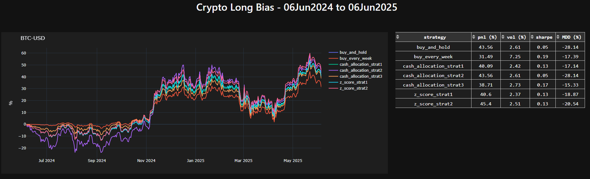

# Crypto Long Bias

This project analyzes and compares different long-bias investment strategies for cryptocurrencies such as Bitcoin, Ethereum, and Solana. It allows users to simulate strategies over a historical window and visualize their performance through an interactive dashboard.

## Strategies Implemented

1. **Buy and Hold** – Buys once at the beginning and holds until the end.
2. **Buy Every Week** – Buys a fixed amount weekly.
3. **Cash Allocation** – Buys an initial amount and invests more when the price variation is below a threshold.
4. **Z-score Allocation** – Buys an initial amount and invests more when the z-score is below a threshold.

## Project Structure

- `hist_analysis.py`: 
  - Collects historical crypto data using `yfinance`
  - Calculates equity lines for each strategy
  - Parameters like thresholds, initial allocation, and date range are configured in `hyperparams.json`

- `dashboard.py`: 
  - Builds a Dash/Plotly dashboard to visualize strategy performance
  - Displays cumulative return charts and a strategy performance table

- `hyperparams.json`: 
  - Contains configuration such as:
    - Cryptos to evaluate
    - Strategies to run
    - Thresholds and allocations
    - Historical date window

## Technologies

- **Python** 3.9
- **Dash** and **Plotly** for interactive visualization
- **Pandas**, **YFinance**, **Scipy** for data processing and analysis

## How to Run

1. Clone the repository:
   ```bash
   git clone https://github.com/yourusername/crypto-long-bias.git
   cd crypto-long-bias
2. Install dependencies
   ```bash
   pip install -r requirements.txt
3. Run the dashboard
   ```bash
   python dashboard.py
   
   To change reference date:
   python dashboard.py -d "AAAA-MM-DD"
4. Adjust configuration (optional):
    ```bash
    Modify hyperparams.json to change cryptos, strategies, thresholds, or date ranges.


## Example

* About the table on the right:
  - PnL: cumulated performance
  - Vol: portfolio's realized volatility
  - Sharpe: sharpe ratio, computed as the average return over the volatility
  - MDD: maximum drawdown, the largest decline from its peak value to its trough value, before it recovers

## Author
Erick Silva
